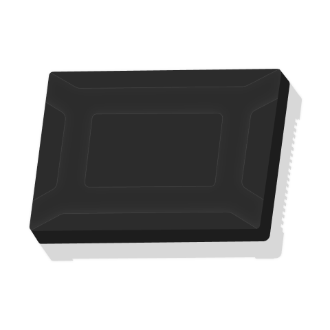
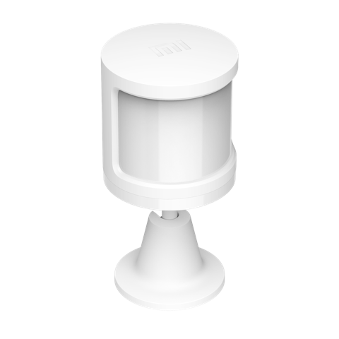
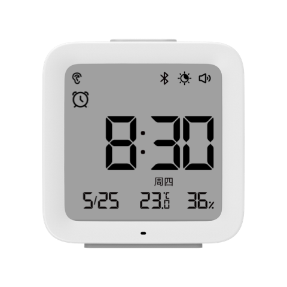
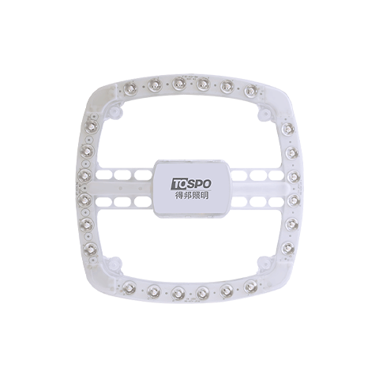

# Xiaomi TLSR Firmware Updates and Overview

### Created by @ATC1441

Firmware folder: [here](/TLSR_firmwares_11.04.2025)

A list of all TLSR based devices information and firmware files:

| Model | Name | Image | Download Firmware | Signed version |
|-------|------|-------|-------------------|----------------|
| 090615.remote.akswr1 | AK Wireless Switch One Key(PTX) |  | [2.1.0_0090](TLSR_firmwares_11.04.2025/090615.remote.akswr1_2.1.0_0090.bin) | [Signed 2.1.0_0090](TLSR_firmwares_11.04.2025/090615.remote.akswr1_2.1.0_0090_signed.bin) |
| 090615.remote.akswr2 | AK Wireless Switch Two Key(PTX) |  | [2.1.0_0090](TLSR_firmwares_11.04.2025/090615.remote.akswr2_2.1.0_0090.bin) | [Signed 2.1.0_0090](TLSR_firmwares_11.04.2025/090615.remote.akswr2_2.1.0_0090_signed.bin) |
| 090615.remote.akswr3 | AK Wireless Switch Three Key(PTX) |  | [2.1.0_0090](TLSR_firmwares_11.04.2025/090615.remote.akswr3_2.1.0_0090.bin) | [Signed 2.1.0_0090](TLSR_firmwares_11.04.2025/090615.remote.akswr3_2.1.0_0090_signed.bin) |
| 090615.remote.btsw1 | PTX wireless switch(bluetooth version) |  | [2.1.0_0091](TLSR_firmwares_11.04.2025/090615.remote.btsw1_2.1.0_0091.bin) | [Signed 2.1.0_0091](TLSR_firmwares_11.04.2025/090615.remote.btsw1_2.1.0_0091_signed.bin) |
| 090615.remote.desksw | PTX X1 Dimming Scene Knob Switch |  | [2.1.1_0003](TLSR_firmwares_11.04.2025/090615.remote.desksw_2.1.1_0003.bin) | [Signed 2.1.1_0003](TLSR_firmwares_11.04.2025/090615.remote.desksw_2.1.1_0003_signed.bin) |
| 090615.remote.hydesk | Haoyi Desktop Dimming Scene Knob Switch (Pro) |  | [2.1.1_0003](TLSR_firmwares_11.04.2025/090615.remote.hydesk_2.1.1_0003.bin) | [Signed 2.1.1_0003](TLSR_firmwares_11.04.2025/090615.remote.hydesk_2.1.1_0003_signed.bin) |
| 090615.remote.x6xnsw | PTX wireless situation knob switch |  | [2.1.0_0091](TLSR_firmwares_11.04.2025/090615.remote.x6xnsw_2.1.0_0091.bin) | [Signed 2.1.0_0091](TLSR_firmwares_11.04.2025/090615.remote.x6xnsw_2.1.0_0091_signed.bin) |
| 913101.tracker.d1 | qborn Child safety seat for small dolphins |  | [2.0.0_0016](TLSR_firmwares_11.04.2025/913101.tracker.d1_2.0.0_0016.bin) | [Signed 2.0.0_0016](TLSR_firmwares_11.04.2025/913101.tracker.d1_2.0.0_0016_signed.bin) |
| ai123.magic_touch.xjb1a | TefeshiAPP intelligent cervical massage instrument |  | [2.0.0_0103](TLSR_firmwares_11.04.2025/ai123.magic_touch.xjb1a_2.0.0_0103.bin) | [Signed 2.0.0_0103](TLSR_firmwares_11.04.2025/ai123.magic_touch.xjb1a_2.0.0_0103_signed.bin) |
| cgllc.clock.dove | Qingping Bluetooth Alarm Clock |  | [1.0.1_0126](TLSR_firmwares_11.04.2025/cgllc.clock.dove_1.0.1_0126.bin) | [Signed 1.0.1_0126](TLSR_firmwares_11.04.2025/cgllc.clock.dove_1.0.1_0126_signed.bin) |
| cgllc.magnet.hodor | Qingping Door/Window Contact Sensor |  | [1.1.1_0210](TLSR_firmwares_11.04.2025/cgllc.magnet.hodor_1.1.1_0210.bin) | [Signed 1.1.1_0210](TLSR_firmwares_11.04.2025/cgllc.magnet.hodor_1.1.1_0210_signed.bin) |
| cgllc.motion.cgpr1 | Qingping Motion & Ambient Light Sensor |  | [1.1.1_0255](TLSR_firmwares_11.04.2025/cgllc.motion.cgpr1_1.1.1_0255.bin) | [Signed 1.1.1_0255](TLSR_firmwares_11.04.2025/cgllc.motion.cgpr1_1.1.1_0255_signed.bin) |
| cgllc.sensor_ht.dk2 | Qingping Temp & RH Monitor Lite (Button Cell) |  | [1.1.1_0209](TLSR_firmwares_11.04.2025/cgllc.sensor_ht.dk2_1.1.1_0209.bin) | [Signed 1.1.1_0209](TLSR_firmwares_11.04.2025/cgllc.sensor_ht.dk2_1.1.1_0209_signed.bin) |
| cgllc.sensor_ht.qpg1 | Qingping Temp & RH Monitor (Button Cell) |  | [1.1.1_0213](TLSR_firmwares_11.04.2025/cgllc.sensor_ht.qpg1_1.1.1_0213.bin) | [Signed 1.1.1_0213](TLSR_firmwares_11.04.2025/cgllc.sensor_ht.qpg1_1.1.1_0213_signed.bin) |
| duka.airm.hf1 | DUKA HF1 Intelligent multi-functional formaldehyde detector |  | [2.1.1_0005](TLSR_firmwares_11.04.2025/duka.airm.hf1_2.1.1_0005.bin) | [Signed 2.1.1_0005](TLSR_firmwares_11.04.2025/duka.airm.hf1_2.1.1_0005_signed.bin) |
| feiyu.hair.am02 | KiCA Wireless High Speed Hair Dryer |  | [2.0.0_0006](TLSR_firmwares_11.04.2025/feiyu.hair.am02_2.0.0_0006.bin) | [Signed 2.0.0_0006](TLSR_firmwares_11.04.2025/feiyu.hair.am02_2.0.0_0006_signed.bin) |
| fengyu.intercom.litev1 | Mi Walkie-Talkie Lite |  | [1.1.1_0088](TLSR_firmwares_11.04.2025/fengyu.intercom.litev1_1.1.1_0088.bin) | [Signed 1.1.1_0088](TLSR_firmwares_11.04.2025/fengyu.intercom.litev1_1.1.1_0088_signed.bin) |
| hccy.sensor_ht.3bx321 | Miko Bluetooth Temperature and Humidity Meter |  | [2.1.1_0006](TLSR_firmwares_11.04.2025/hccy.sensor_ht.3bx321_2.1.1_0006.bin) | [Signed 2.1.1_0006](TLSR_firmwares_11.04.2025/hccy.sensor_ht.3bx321_2.1.1_0006_signed.bin) |
| hccy.sensor_ht.mikos | MiKO Square Temperature and Humidity |  | [2.1.1_0007](TLSR_firmwares_11.04.2025/hccy.sensor_ht.mikos_2.1.1_0007.bin) | [Signed 2.1.1_0007](TLSR_firmwares_11.04.2025/hccy.sensor_ht.mikos_2.1.1_0007_signed.bin) |
| janshi.magic_touch.g20 | N/A | No image available | [2.0.0_0024](TLSR_firmwares_11.04.2025/janshi.magic_touch.g20_2.0.0_0024.bin) | [Signed 2.0.0_0024](TLSR_firmwares_11.04.2025/janshi.magic_touch.g20_2.0.0_0024_signed.bin) |
| janshi.magic_touch.g2 | G2 Spinal comfort neck massager |  | [1.1.1_0025](TLSR_firmwares_11.04.2025/janshi.magic_touch.g2_1.1.1_0025.bin) | [Signed 1.1.1_0025](TLSR_firmwares_11.04.2025/janshi.magic_touch.g2_1.1.1_0025_signed.bin) |
| janshi.magic_touch.u7p | Jeeback Smart Shoulder and Neck Massager |  | [2.1.0_0015](TLSR_firmwares_11.04.2025/janshi.magic_touch.u7p_2.1.0_0015.bin) | [Signed 2.1.0_0015](TLSR_firmwares_11.04.2025/janshi.magic_touch.u7p_2.1.0_0015_signed.bin) |
| janshi.magic_touch.u9p | Jeeback massage pillow |  | [2.1.0_0012](TLSR_firmwares_11.04.2025/janshi.magic_touch.u9p_2.1.0_0012.bin) | [Signed 2.1.0_0012](TLSR_firmwares_11.04.2025/janshi.magic_touch.u9p_2.1.0_0012_signed.bin) |
| jare.magic_touch.jr688 | Jiaren Massage Shawl JR-688 |  | [2.0.0_0110](TLSR_firmwares_11.04.2025/jare.magic_touch.jr688_2.0.0_0110.bin) | [Signed 2.0.0_0110](TLSR_firmwares_11.04.2025/jare.magic_touch.jr688_2.0.0_0110_signed.bin) |
| jback.magic_touch.e10 | Jeeback E10 eye massager |  | [2.0.0_0110](TLSR_firmwares_11.04.2025/jback.magic_touch.e10_2.0.0_0110.bin) | [Signed 2.0.0_0110](TLSR_firmwares_11.04.2025/jback.magic_touch.e10_2.0.0_0110_signed.bin) |
| jback.magic_touch.e9 | E9 Plus 3D Vibrating eye massager |  | [2.0.0_0110](TLSR_firmwares_11.04.2025/jback.magic_touch.e9_2.0.0_0110.bin) | [Signed 2.0.0_0110](TLSR_firmwares_11.04.2025/jback.magic_touch.e9_2.0.0_0110_signed.bin) |
| jback.magic_touch.g3 | Chiropractic G3 Pro intelligent neck massager |  | [2.0.0_0124](TLSR_firmwares_11.04.2025/jback.magic_touch.g3_2.0.0_0124.bin) | [Signed 2.0.0_0124](TLSR_firmwares_11.04.2025/jback.magic_touch.g3_2.0.0_0124_signed.bin) |
| jback.magic_touch.g9 | Waist Massager |  | [2.0.0_0023](TLSR_firmwares_11.04.2025/jback.magic_touch.g9_2.0.0_0023.bin) | [Signed 2.0.0_0023](TLSR_firmwares_11.04.2025/jback.magic_touch.g9_2.0.0_0023_signed.bin) |
| jback.magic_touch.k1pr | Jeeback Intelligent Neck Massager |  | [2.0.0_0023](TLSR_firmwares_11.04.2025/jback.magic_touch.k1pr_2.0.0_0023.bin) | [Signed 2.0.0_0023](TLSR_firmwares_11.04.2025/jback.magic_touch.k1pr_2.0.0_0023_signed.bin) |
| jieman.magic_touch.g791 | GAX 8D Cervical vertebra massage apparatus |  | [2.0.0_0106](TLSR_firmwares_11.04.2025/jieman.magic_touch.g791_2.0.0_0106.bin) | [Signed 2.0.0_0106](TLSR_firmwares_11.04.2025/jieman.magic_touch.g791_2.0.0_0106_signed.bin) |
| jieman.magic_touch.g792 | Kangdoli 8D Cervical vertebra massage apparatus |  | [2.0.0_0106](TLSR_firmwares_11.04.2025/jieman.magic_touch.g792_2.0.0_0106.bin) | [Signed 2.0.0_0106](TLSR_firmwares_11.04.2025/jieman.magic_touch.g792_2.0.0_0106_signed.bin) |
| jieman.magic_touch.j10 | GAX 4D Intelligent Cervical Massage Instrument X |  | [2.0.0_0110](TLSR_firmwares_11.04.2025/jieman.magic_touch.j10_2.0.0_0110.bin) | [Signed 2.0.0_0110](TLSR_firmwares_11.04.2025/jieman.magic_touch.j10_2.0.0_0110_signed.bin) |
| jieman.magic_touch.js01 | Jishu  Intelligent cervical spine massage instrument |  | [1.1.1_0016](TLSR_firmwares_11.04.2025/jieman.magic_touch.js01_1.1.1_0016.bin) | [Signed 1.1.1_0016](TLSR_firmwares_11.04.2025/jieman.magic_touch.js01_1.1.1_0016_signed.bin) |
| jieman.magic_touch.js03 | Jishu Smart Massager V1 |  | [1.1.1_0016](TLSR_firmwares_11.04.2025/jieman.magic_touch.js03_1.1.1_0016.bin) | [Signed 1.1.1_0016](TLSR_firmwares_11.04.2025/jieman.magic_touch.js03_1.1.1_0016_signed.bin) |
| jieman.magic_touch.js78 | Jishu Intelligent Cervical Massage |  | [1.1.4_0003](TLSR_firmwares_11.04.2025/jieman.magic_touch.js78_1.1.4_0003.bin) | [Signed 1.1.4_0003](TLSR_firmwares_11.04.2025/jieman.magic_touch.js78_1.1.4_0003_signed.bin) |
| jieman.magic_touch.kdl0 | Kangduoli Smart Massager |  | [1.1.1_0016](TLSR_firmwares_11.04.2025/jieman.magic_touch.kdl0_1.1.1_0016.bin) | [Signed 1.1.1_0016](TLSR_firmwares_11.04.2025/jieman.magic_touch.kdl0_1.1.1_0016_signed.bin) |
| jieman.magic_touch.ms9 | Intelligent cervical massage instrument |  | [1.1.4_0005](TLSR_firmwares_11.04.2025/jieman.magic_touch.ms9_1.1.4_0005.bin) | [Signed 1.1.4_0005](TLSR_firmwares_11.04.2025/jieman.magic_touch.ms9_1.1.4_0005_signed.bin) |
| jieman.magic_touch.newf | New for Smart Massager |  | [1.1.1_0016](TLSR_firmwares_11.04.2025/jieman.magic_touch.newf_1.1.1_0016.bin) | [Signed 1.1.1_0016](TLSR_firmwares_11.04.2025/jieman.magic_touch.newf_1.1.1_0016_signed.bin) |
| jieman.magic_touch.t100 | GAX Intelligent Head Massager |  | [2.0.0_0110](TLSR_firmwares_11.04.2025/jieman.magic_touch.t100_2.0.0_0110.bin) | [Signed 2.0.0_0110](TLSR_firmwares_11.04.2025/jieman.magic_touch.t100_2.0.0_0110_signed.bin) |
| jieman.magic_touch.tfs2 | Tefeishi Smart Massager |  | [1.1.1_0016](TLSR_firmwares_11.04.2025/jieman.magic_touch.tfs2_1.1.1_0016.bin) | [Signed 1.1.1_0016](TLSR_firmwares_11.04.2025/jieman.magic_touch.tfs2_1.1.1_0016_signed.bin) |
| jieman.magic_touch.tsf1 | Tefeishi Smart Massager |  | [1.1.1_0016](TLSR_firmwares_11.04.2025/jieman.magic_touch.tsf1_1.1.1_0016.bin) | [Signed 1.1.1_0016](TLSR_firmwares_11.04.2025/jieman.magic_touch.tsf1_1.1.1_0016_signed.bin) |
| jieman.magic_touch.u101 | GAX multifunctional cervical massage pillow |  | [2.0.0_0106](TLSR_firmwares_11.04.2025/jieman.magic_touch.u101_2.0.0_0106.bin) | [Signed 2.0.0_0106](TLSR_firmwares_11.04.2025/jieman.magic_touch.u101_2.0.0_0106_signed.bin) |
| jieman.magic_touch.u102 | GAX Intelligent U Messager X |  | [2.0.0_0110](TLSR_firmwares_11.04.2025/jieman.magic_touch.u102_2.0.0_0110.bin) | [Signed 2.0.0_0110](TLSR_firmwares_11.04.2025/jieman.magic_touch.u102_2.0.0_0110_signed.bin) |
| jieman.magic_touch.u1 | GAX Intelligent U-shaped massager |  | [2.0.0_0106](TLSR_firmwares_11.04.2025/jieman.magic_touch.u1_2.0.0_0106.bin) | [Signed 2.0.0_0106](TLSR_firmwares_11.04.2025/jieman.magic_touch.u1_2.0.0_0106_signed.bin) |
| jieman.magic_touch.x5b | Yubaina intelligent cervical massage instrument |  | [1.1.1_0016](TLSR_firmwares_11.04.2025/jieman.magic_touch.x5b_1.1.1_0016.bin) | [Signed 1.1.1_0016](TLSR_firmwares_11.04.2025/jieman.magic_touch.x5b_1.1.1_0016_signed.bin) |
| jieman.magic_touch.x5u | USK Smart Cervical Massage Apparatus |  | [1.1.1_0016](TLSR_firmwares_11.04.2025/jieman.magic_touch.x5u_1.1.1_0016.bin) | [Signed 1.1.1_0016](TLSR_firmwares_11.04.2025/jieman.magic_touch.x5u_1.1.1_0016_signed.bin) |
| jieman.magic_touch.yb1 | GAX 4D Smart waist massager |  | [2.0.0_0106](TLSR_firmwares_11.04.2025/jieman.magic_touch.yb1_2.0.0_0106.bin) | [Signed 2.0.0_0106](TLSR_firmwares_11.04.2025/jieman.magic_touch.yb1_2.0.0_0106_signed.bin) |
| jieman.magic_touch.ys01 | Yashen Intelligent cervical massage instrument |  | [1.1.4_0006](TLSR_firmwares_11.04.2025/jieman.magic_touch.ys01_1.1.4_0006.bin) | [Signed 1.1.4_0006](TLSR_firmwares_11.04.2025/jieman.magic_touch.ys01_1.1.4_0006_signed.bin) |
| jieman.magic_touch.ys02 | Yashen  Smart Massager |  | [1.1.1_0016](TLSR_firmwares_11.04.2025/jieman.magic_touch.ys02_1.1.1_0016.bin) | [Signed 1.1.1_0016](TLSR_firmwares_11.04.2025/jieman.magic_touch.ys02_1.1.1_0016_signed.bin) |
| kotei.airrtc.ktt001 | KOTEI graphene thermostat |  | [2.1.1_0004](TLSR_firmwares_11.04.2025/kotei.airrtc.ktt001_2.1.1_0004.bin) | [Signed 2.1.1_0004](TLSR_firmwares_11.04.2025/kotei.airrtc.ktt001_2.1.1_0004_signed.bin) |
| lhang.magic_touch.t3 | Slow passenger shoulder and neck massage massager T3 |  | [2.0.0_0005](TLSR_firmwares_11.04.2025/lhang.magic_touch.t3_2.0.0_0005.bin) | [Signed 2.0.0_0005](TLSR_firmwares_11.04.2025/lhang.magic_touch.t3_2.0.0_0005_signed.bin) |
| lhang.magic_touch.y5 | Slow Air Massage Belt Y5 |  | [2.0.0_0110](TLSR_firmwares_11.04.2025/lhang.magic_touch.y5_2.0.0_0110.bin) | [Signed 2.0.0_0110](TLSR_firmwares_11.04.2025/lhang.magic_touch.y5_2.0.0_0110_signed.bin) |
| linp.flood.rs1bb | Linptect Flood and Rain Sensor |  | [2.1.1_0057](TLSR_firmwares_11.04.2025/linp.flood.rs1bb_2.1.1_0057.bin) | [Signed 2.1.1_0057](TLSR_firmwares_11.04.2025/linp.flood.rs1bb_2.1.1_0057_signed.bin) |
| linp.magnet.m1 | Linptech Door and Window Sensor |  | [2.0.0_0007](TLSR_firmwares_11.04.2025/linp.magnet.m1_2.0.0_0007.bin) | [Signed 2.0.0_0007](TLSR_firmwares_11.04.2025/linp.magnet.m1_2.0.0_0007_signed.bin) |
| linp.motion.h1 | Linptech Motion Sensor |  | [2.0.0_0004](TLSR_firmwares_11.04.2025/linp.motion.h1_2.0.0_0004.bin) | [Signed 2.0.0_0004](TLSR_firmwares_11.04.2025/linp.motion.h1_2.0.0_0004_signed.bin) |
| linp.motion.hs1bb1 | Linptech Motion Sensor 2 |  | [2.1.0_0022](TLSR_firmwares_11.04.2025/linp.motion.hs1bb1_2.1.0_0022.bin) | [Signed 2.1.0_0022](TLSR_firmwares_11.04.2025/linp.motion.hs1bb1_2.1.0_0022_signed.bin) |
| linp.motion.hs1bb2 | Linptech Motion Sensor 3 |  | [2.1.1_0031](TLSR_firmwares_11.04.2025/linp.motion.hs1bb2_2.1.1_0031.bin) | [Signed 2.1.1_0031](TLSR_firmwares_11.04.2025/linp.motion.hs1bb2_2.1.1_0031_signed.bin) |
| linp.remote.ks1 | Linptech Wireless Switch KS1 |  | [2.1.1_0021](TLSR_firmwares_11.04.2025/linp.remote.ks1_2.1.1_0021.bin) | [Signed 2.1.1_0021](TLSR_firmwares_11.04.2025/linp.remote.ks1_2.1.1_0021_signed.bin) |
| linp.senpres.ps1bb | Linptech Pressure Present or Not Sensor |  | [2.1.1_0041](TLSR_firmwares_11.04.2025/linp.senpres.ps1bb_2.1.1_0041.bin) | [Signed 2.1.1_0041](TLSR_firmwares_11.04.2025/linp.senpres.ps1bb_2.1.1_0041_signed.bin) |
| linp.sensor_ht.ks1bp | Linptech Wireless Switch KS1Pro |  | [2.1.1_0032](TLSR_firmwares_11.04.2025/linp.sensor_ht.ks1bp_2.1.1_0032.bin) | [Signed 2.1.1_0032](TLSR_firmwares_11.04.2025/linp.sensor_ht.ks1bp_2.1.1_0032_signed.bin) |
| linp.sensor_occupy.es2b | Linptech Human Presence Sensor ES2 |  | [2.1.1_0048](TLSR_firmwares_11.04.2025/linp.sensor_occupy.es2b_2.1.1_0048.bin) | [Signed 2.1.1_0048](TLSR_firmwares_11.04.2025/linp.sensor_occupy.es2b_2.1.1_0048_signed.bin) |
| linp.sensor_occupy.es2 | Linptech Human Presence Sensor ES3 |  | [2.1.1_0063](TLSR_firmwares_11.04.2025/linp.sensor_occupy.es2_2.1.1_0063.bin) | [Signed 2.1.1_0063](TLSR_firmwares_11.04.2025/linp.sensor_occupy.es2_2.1.1_0063_signed.bin) |
| lumi.flood.bmcn01 | Mi Flood Detector |  | [1.1.1_0018](TLSR_firmwares_11.04.2025/lumi.flood.bmcn01_1.1.1_0018.bin) | [Signed 1.1.1_0018](TLSR_firmwares_11.04.2025/lumi.flood.bmcn01_1.1.1_0018_signed.bin) |
| lumi.motion.bmgl01 | Mi Motion Sensor 2 |  | [1.1.1_0011](TLSR_firmwares_11.04.2025/lumi.motion.bmgl01_1.1.1_0011.bin) | [Signed 1.1.1_0011](TLSR_firmwares_11.04.2025/lumi.motion.bmgl01_1.1.1_0011_signed.bin) |
| lumi.remote.acn003 | Aqara Wireless Remote Switch E1 (Single Rocker) |  | [0.0.0_0003](TLSR_firmwares_11.04.2025/lumi.remote.acn003_0.0.0_0003.bin) | [Signed 0.0.0_0003](TLSR_firmwares_11.04.2025/lumi.remote.acn003_0.0.0_0003_signed.bin) |
| lumi.remote.mcn001 | Xiaomi Wireless Switch (Bluetooth) |  | [2.0.0_0014](TLSR_firmwares_11.04.2025/lumi.remote.mcn001_2.0.0_0014.bin) | [Signed 2.0.0_0014](TLSR_firmwares_11.04.2025/lumi.remote.mcn001_2.0.0_0014_signed.bin) |
| lumi.sensor_smoke.mcn02 | Mi Smoke Detector |  | [1.1.1_0010](TLSR_firmwares_11.04.2025/lumi.sensor_smoke.mcn02_1.1.1_0010.bin) | [Signed 1.1.1_0010](TLSR_firmwares_11.04.2025/lumi.sensor_smoke.mcn02_1.1.1_0010_signed.bin) |
| miaomiaoce.sensor_ht.a1 | Meawow Smart Voice Control Clock |  | [2.1.1_0029](TLSR_firmwares_11.04.2025/miaomiaoce.sensor_ht.a1_2.1.1_0029.bin) | [Signed 2.1.1_0029](TLSR_firmwares_11.04.2025/miaomiaoce.sensor_ht.a1_2.1.1_0029_signed.bin) |
| miaomiaoce.sensor_ht.t2 | 小米米家蓝牙温湿度计2 |  | [2.1.1_0159](TLSR_firmwares_11.04.2025/miaomiaoce.sensor_ht.t2_2.1.1_0159.bin) | [Signed 2.1.1_0159](TLSR_firmwares_11.04.2025/miaomiaoce.sensor_ht.t2_2.1.1_0159_signed.bin) |
| miaomiaoce.sensor_ht.t8 | 小米米家电子温湿度计Pro |  | [2.0.1_0021](TLSR_firmwares_11.04.2025/miaomiaoce.sensor_ht.t8_2.0.1_0021.bin) | [Signed 2.0.1_0021](TLSR_firmwares_11.04.2025/miaomiaoce.sensor_ht.t8_2.0.1_0021_signed.bin) |
| miaomiaoce.sensor_ht.t9 | Mijia Smart Temperature and Humidity Monitor 3 |  | [2.0.0_0026](TLSR_firmwares_11.04.2025/miaomiaoce.sensor_ht.t9_2.0.0_0026.bin) | [Signed 2.0.0_0026](TLSR_firmwares_11.04.2025/miaomiaoce.sensor_ht.t9_2.0.0_0026_signed.bin) |
| mmgg.feeder.bowl | Pawbby smart pet bowl |  | [1.1.1_0017](TLSR_firmwares_11.04.2025/mmgg.feeder.bowl_1.1.1_0017.bin) | [Signed 1.1.1_0017](TLSR_firmwares_11.04.2025/mmgg.feeder.bowl_1.1.1_0017_signed.bin) |
| nancii.toothbrush.t600 | Nancii Smart Electric Toothbrush T600 |  | [2.0.0_0013](TLSR_firmwares_11.04.2025/nancii.toothbrush.t600_2.0.0_0013.bin) | [Signed 2.0.0_0013](TLSR_firmwares_11.04.2025/nancii.toothbrush.t600_2.0.0_0013_signed.bin) |
| onej.vacuum.clean | Xinshe True Wet Cleaning Intelligent Window Cleaning Machine YW703 |  | [2.0.0_0110](TLSR_firmwares_11.04.2025/onej.vacuum.clean_2.0.0_0110.bin) | [Signed 2.0.0_0110](TLSR_firmwares_11.04.2025/onej.vacuum.clean_2.0.0_0110_signed.bin) |
| qihang.magic_touch.4pro | Tu Wei Le High Back and Waist Massager |  | [2.0.0_0005](TLSR_firmwares_11.04.2025/qihang.magic_touch.4pro_2.0.0_0005.bin) | [Signed 2.0.0_0005](TLSR_firmwares_11.04.2025/qihang.magic_touch.4pro_2.0.0_0005_signed.bin) |
| qihang.magic_touch.nk01 | Tunvole U-shaped massage pillow U2 |  | [2.0.0_0025](TLSR_firmwares_11.04.2025/qihang.magic_touch.nk01_2.0.0_0025.bin) | [Signed 2.0.0_0025](TLSR_firmwares_11.04.2025/qihang.magic_touch.nk01_2.0.0_0025_signed.bin) |
| qihang.magic_touch.nk08 | Tunvole Shoulder and Neck Massager |  | [2.0.0_0019](TLSR_firmwares_11.04.2025/qihang.magic_touch.nk08_2.0.0_0019.bin) | [Signed 2.0.0_0019](TLSR_firmwares_11.04.2025/qihang.magic_touch.nk08_2.0.0_0019_signed.bin) |
| qihang.magic_touch.nk8p | Tunvole Shoulder and Neck Massager pro |  | [2.0.0_0037](TLSR_firmwares_11.04.2025/qihang.magic_touch.nk8p_2.0.0_0037.bin) | [Signed 2.0.0_0037](TLSR_firmwares_11.04.2025/qihang.magic_touch.nk8p_2.0.0_0037_signed.bin) |
| qihang.magic_touch.ty4 | Tunvole Waist massager |  | [2.0.0_0013](TLSR_firmwares_11.04.2025/qihang.magic_touch.ty4_2.0.0_0013.bin) | [Signed 2.0.0_0013](TLSR_firmwares_11.04.2025/qihang.magic_touch.ty4_2.0.0_0013_signed.bin) |
| qihang.magic_touch.y5 | tunvole neck and waist massage pillow Y5 |  | [2.1.0_0022](TLSR_firmwares_11.04.2025/qihang.magic_touch.y5_2.1.0_0022.bin) | [Signed 2.1.0_0022](TLSR_firmwares_11.04.2025/qihang.magic_touch.y5_2.1.0_0022_signed.bin) |
| shcs.analyzer.20md | BaiJie Blood Glucose Uric Acid Cholesterol Analyzer |  | [2.1.1_0180](TLSR_firmwares_11.04.2025/shcs.analyzer.20md_2.1.1_0180.bin) | [Signed 2.1.1_0180](TLSR_firmwares_11.04.2025/shcs.analyzer.20md_2.1.1_0180_signed.bin) |
| smooky.jmprope.ts43 | Smooky Intelligent rope skipping |  | [2.1.1_0178](TLSR_firmwares_11.04.2025/smooky.jmprope.ts43_2.1.1_0178.bin) | [Signed 2.1.1_0178](TLSR_firmwares_11.04.2025/smooky.jmprope.ts43_2.1.1_0178_signed.bin) |
| tospo1.light.rpc01 | TOSPO LED Module |  | [1.4.0_0014](TLSR_firmwares_11.04.2025/tospo1.light.rpc01_1.4.0_0014.bin) | [Signed 1.4.0_0014](TLSR_firmwares_11.04.2025/tospo1.light.rpc01_1.4.0_0014_signed.bin) |
| vchon.sensor_ht.mbs17 | MBoos hygrothermograph MBS-17 |  | [2.1.1_0175](TLSR_firmwares_11.04.2025/vchon.sensor_ht.mbs17_2.1.1_0175.bin) | [Signed 2.1.1_0175](TLSR_firmwares_11.04.2025/vchon.sensor_ht.mbs17_2.1.1_0175_signed.bin) |
| xiaomi.cooler.r02p | Xiaomi Magnetic Cooling Back Clip |  | [2.1.1_0030](TLSR_firmwares_11.04.2025/xiaomi.cooler.r02p_2.1.1_0030.bin) | [Signed 2.1.1_0030](TLSR_firmwares_11.04.2025/xiaomi.cooler.r02p_2.1.1_0030_signed.bin) |
| xiaomi.intercom.3lite | Xiaomi Walkie-Talkie 3 Lite |  | [2.1.1_0250](TLSR_firmwares_11.04.2025/xiaomi.intercom.3lite_2.1.1_0250.bin) | [Signed 2.1.1_0250](TLSR_firmwares_11.04.2025/xiaomi.intercom.3lite_2.1.1_0250_signed.bin) |
| xiaomi.mic.s33 | Xiaomi Karaoke Microphone |  | [2.1.0_0021](TLSR_firmwares_11.04.2025/xiaomi.mic.s33_2.1.0_0021.bin) | [Signed 2.1.0_0021](TLSR_firmwares_11.04.2025/xiaomi.mic.s33_2.1.0_0021_signed.bin) |
| xiaomi.pet_waterer.002 | Mijia Wireless Smart Pet Fountain |  | [2.1.1_0029](TLSR_firmwares_11.04.2025/xiaomi.pet_waterer.002_2.1.1_0029.bin) | [Signed 2.1.1_0029](TLSR_firmwares_11.04.2025/xiaomi.pet_waterer.002_2.1.1_0029_signed.bin) |
| xiaomi.sensor_ht.mini | Mijia Smart Temperature and Humidity Monitor 3 Mini |  | [2.1.1_0009](TLSR_firmwares_11.04.2025/xiaomi.sensor_ht.mini_2.1.1_0009.bin) | [Signed 2.1.1_0009](TLSR_firmwares_11.04.2025/xiaomi.sensor_ht.mini_2.1.1_0009_signed.bin) |
| yeelink.remote.sw1 | Yeelight Smart Wireless Switch (Single Key) |  | [2.1.0_0090](TLSR_firmwares_11.04.2025/yeelink.remote.sw1_2.1.0_0090.bin) | [Signed 2.1.0_0090](TLSR_firmwares_11.04.2025/yeelink.remote.sw1_2.1.0_0090_signed.bin) |
| yeelink.remote.sw2 | Yeelight Smart Wireless Switch (Double Keys) |  | [2.1.0_0090](TLSR_firmwares_11.04.2025/yeelink.remote.sw2_2.1.0_0090.bin) | [Signed 2.1.0_0090](TLSR_firmwares_11.04.2025/yeelink.remote.sw2_2.1.0_0090_signed.bin) |
| yeelink.remote.swd5 | Yeelight Scene Switch (Wireless Four Buttons) |  | [2.1.0_0092](TLSR_firmwares_11.04.2025/yeelink.remote.swd5_2.1.0_0092.bin) | [Signed 2.1.0_0092](TLSR_firmwares_11.04.2025/yeelink.remote.swd5_2.1.0_0092_signed.bin) |
| yeeloc.etool.m09 | Yeelock Drawer Cabinet Switch Pro |  | [2.1.1_1026](TLSR_firmwares_11.04.2025/yeeloc.etool.m09_2.1.1_1026.bin) | [Signed 2.1.1_1026](TLSR_firmwares_11.04.2025/yeeloc.etool.m09_2.1.1_1026_signed.bin) |
| yongsh.sensor_ht.kd30 | Temperature Genie Hygrograph KD30 |  | [2.1.1_0181](TLSR_firmwares_11.04.2025/yongsh.sensor_ht.kd30_2.1.1_0181.bin) | [Signed 2.1.1_0181](TLSR_firmwares_11.04.2025/yongsh.sensor_ht.kd30_2.1.1_0181_signed.bin) |
| youha.breast.s1 | Youha S1 breast pump |  | [2.0.0_0110](TLSR_firmwares_11.04.2025/youha.breast.s1_2.0.0_0110.bin) | [Signed 2.0.0_0110](TLSR_firmwares_11.04.2025/youha.breast.s1_2.0.0_0110_signed.bin) |
| yuemee.mic.s32 | N/A | No image available | [2.1.0_0080](TLSR_firmwares_11.04.2025/yuemee.mic.s32_2.1.0_0080.bin) | [Signed 2.1.0_0080](TLSR_firmwares_11.04.2025/yuemee.mic.s32_2.1.0_0080_signed.bin) |
| yunmi.kettle.v13 | Mi Smart Kettle Pro |  | [2.1.0_0030](TLSR_firmwares_11.04.2025/yunmi.kettle.v13_2.1.0_0030.bin) | [Signed 2.1.0_0030](TLSR_firmwares_11.04.2025/yunmi.kettle.v13_2.1.0_0030_signed.bin) |
| yunmi.kettle.v9 | Mi Smart Kettle Pro |  | [4.1.0_0024](TLSR_firmwares_11.04.2025/yunmi.kettle.v9_4.1.0_0024.bin) | [Signed 4.1.0_0024](TLSR_firmwares_11.04.2025/yunmi.kettle.v9_4.1.0_0024_signed.bin) |
| zdeer.ajh.ajb | Warm Moxibustion Box |  | [1.0.1_0008](TLSR_firmwares_11.04.2025/zdeer.ajh.ajb_1.0.1_0008.bin) | [Signed 1.0.1_0008](TLSR_firmwares_11.04.2025/zdeer.ajh.ajb_1.0.1_0008_signed.bin) |
| zimi.mosq.v1 | Mijia smart mosquito repellent |  | [1.1.4_0023](TLSR_firmwares_11.04.2025/zimi.mosq.v1_1.1.4_0023.bin) | [Signed 1.1.4_0023](TLSR_firmwares_11.04.2025/zimi.mosq.v1_1.1.4_0023_signed.bin) |
